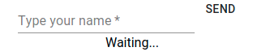
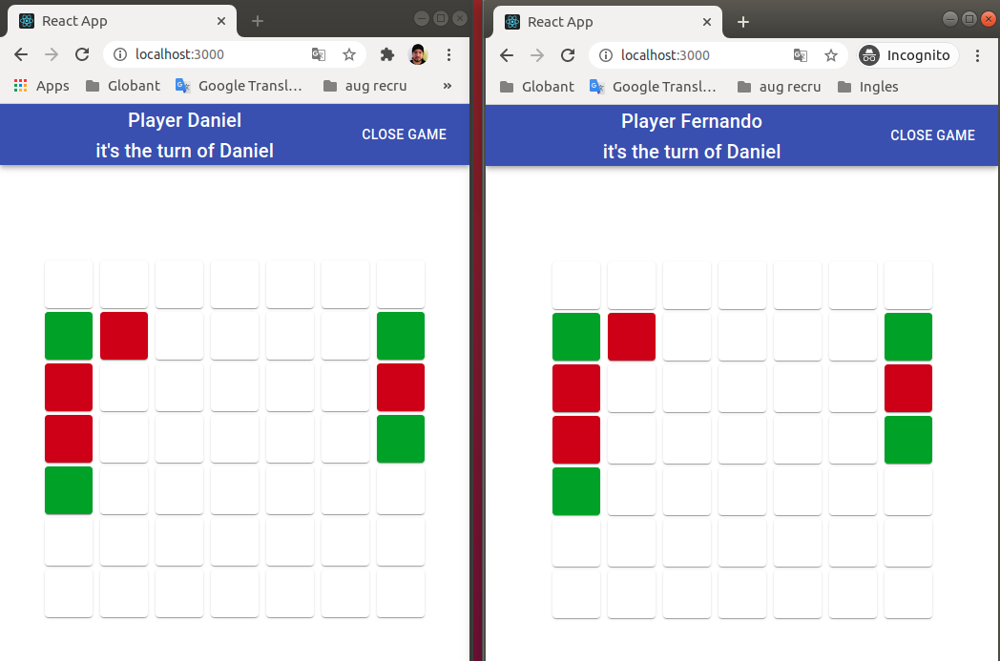

# Getting Started 

In the test directory, you can run:

### `docker-compose build`
### `docker-compose up`

Open [http://localhost:3000](http://localhost:3000) to view it in the browser.

You need two browser windows open each with a different player name.

enter your name and you should see something like this.

